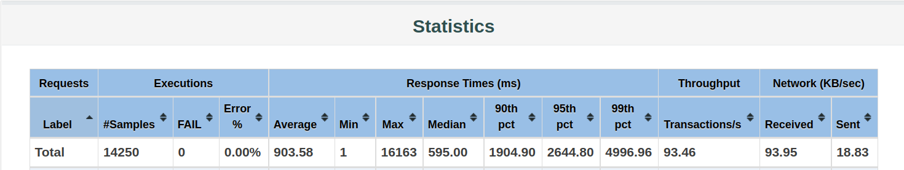
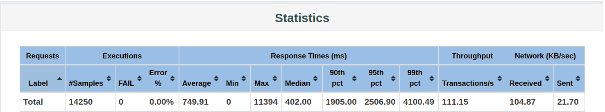
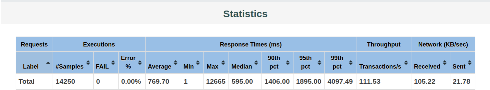

# Scalable Web Applications

This demo shows an example of building web applications that are scalable. Problems related with the scaling procedure, such as data caching and session sharing, are also explored. 

## Notice

For convenience, the original JD powered backend is discarded in favor of a fake DB implementation, which provides a range of different queries and simply uses `sleep()` to simulate the processing. The reason why I decided to do that is JD sometimes requires us to first log in before searching anything, and this would cause an internal error. I also replaced the original `Cart` model with `SessionData`, which just stores the messages you input from the web page. With these changes, we can still experiment with all the problems involved in scalable web applications.

## Single Server

The basic version is to use a single server with local cache. We can change the `active` field in `application.properties` to boot the application in proper configurations. Actually, for the purpose of load testing, we'll start the application in a docker container and limit the computing resources used by it. The docker corresponding stuff is recorded [here](docker.md). Generally, each container is assigned a half core. 

After the application finishes its starting, we'll use `jmeter` to perform a load testing against it. For load testing before scaling, we'll use this [file](jmeter/load-testing-before-scale.jmx) as the test configuration (You can open it in jmeter GUI). Generally, it spawns 50 threads (means 50 different users) in 1 second and repeats with the same 50 users for 15 seconds. The performance report autogenerated by jmeter can be checked out [here](jmeter/report/before-scale/2022-03-27-19:47:27/index.html). We can see the average delay is around 900 ms.

## Horizontal Scaling

To shorten the response time, we can scale the architecture horizontally. By duplicating the previous container and run it in another port, we now get two servers providing the same service. Then we can use `haproxy` as a load balancer and make it route the requests to each server. The haproxy corresponding stuff can be checked [here](haproxy/haproxy.md). Since we now have two servers, we should expect to see a drop in the response delay. Perform a load testing with a [slightly changed script](jmeter/load-testing-after-scale.jmx), we get this (the full report can be found [here](jmeter/report/after-scale/2022-03-27-20:00:17/index.html)): 

The average response time is reduced to 750 ms (It's unlikely to be 450 ms, which is 900 ms / 2). 

However, there is a big problem here and the implementation is actually wrong. If you open the browser and visit the haproxy server directly, you'll find that the messages you typed in are never be stored. This is due to the cookie overwriting . The two servers use the sample cookie name to store session ID, so they'll overwrite each other's cookie and reset the session after finding that the session ID is not what previously sent.

## Data Caching and Session Sharing

To solve the above problem, we'll need a common cache so that the same session can be shared between the servers. In addition, we're also going to cache the query results so that each query is carried out only once. By changing the `active` field in `application-properties` to be `with-redis`, we get the final version (the redis corresponding stuff can be found [here](redis/redis.md)): 

The application now runs correctly, but with a slightly increased delay. It's just what we're expecting to see, since

1. Data caching does reduce the number of real calculations, but also introduces the network delay to contact redis server;
2. We use redis for caching mainly because local caching is very limited and not scalable, instead of speeding up the application;
3. By using a separate cache server, we are actually trading efficiency for a more resilient architecture

## Comment

I've seen the discussion about whether to implement the add/remove operation in original webpos application. However, I have finished this assignment at that time and decided not to refactor it anyway. 

As an alternative, the demo here will support add/remove a message to further illustrate the data consistency in scalable web applications. You can check out the correctness.
