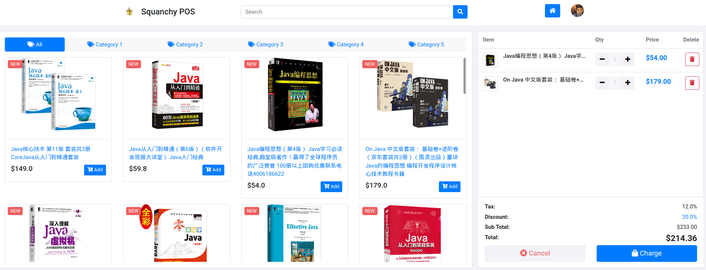

# WebPOS

The demo shows a simple POS system in MVC architecture, which replaces the shell interface in aw02 with a [pos web ui](https://github.com/bshbsh404/simple-pos-ui
).



To run

```shell
mvn clean spring-boot:run
```

Currently, it only supports modifications to the shopping cart and calculates fees in real time. More features and code optimizations are in the works.

# Understanding MVC

Model-View-Controller (MVC) is a software design pattern commonly used to implement user interfaces, data and controlling logic. It emphasizes a separation between the software's business logic and display. This "separation of concerns" provides for a better division of labor and improved maintenance. The standard MVC architecture contains a model managing data and business logic, a view handling layout and display, a controller routing commands between the model and view[<sup>[1]</sup>](https://developer.mozilla.org/en-US/docs/Glossary/MVC). The model may also directly notify the view to do update, which is common in GUI frameworks, but rare in web applications.

## The Model

The model defines what data the app should contain and how the data should be manipulated. In this demo, the model is made up of `PosService` which implements the business logic, and `PosDB` that provides data storage. Model in web applications seldom directly notifies view to do update, since there can be multiple views from different clients. It's neither efficient nor appropriate for the model to figure out where the response should go.

## The View

The view defines how the data should be displayed and how the app should be interacted with. In this demo, the view is initialized with [Thymeleaf](https://www.thymeleaf.org/) template engine and updated partly using [jQuery](https://jquery.com/) library. Data is fetched from the server using ajax and rendered in the browser using html, javascript and css.

## The Controller

The controller performs logic that updates the model and view in response to request from users. It's designed to decouple view and model, so that the model needn't know how the data is displayed and focus on the implementation of business logic. It also makes the view and model transparent to each other. With controller routing the messages, the view needn't know which model it's interacting with or whether it's communicating with the same model, and vice versa. This provides us with a lot of flexibility to extend the application.

# Comments

It's cumbersome to initialize with a template engine and then update using js. Developers must ensure that the template is consistent with the js code. Otherwise, it's very likely that you'll get some buggy performance after refreshing the web page.
